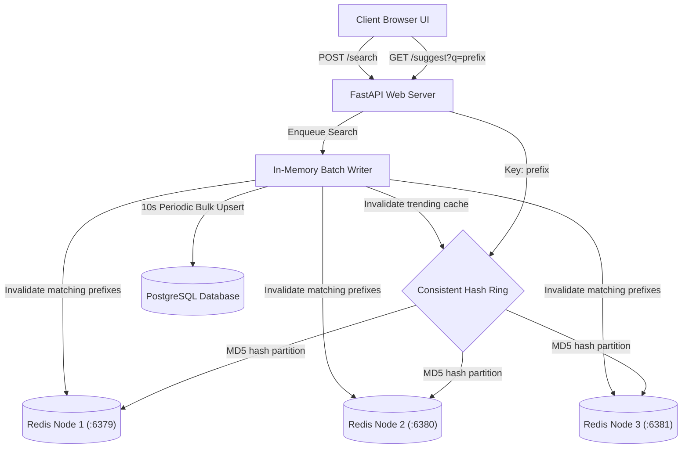

# Aura Search Typeahead System

A highly scalable, distributed, low-latency search typeahead system designed to serve prefix autocomplete recommendations. The system is backed by a PostgreSQL data store and features a distributed Redis caching layer routed via Consistent Hashing and optimized for write performance using an in-memory Batch Writer buffer.

---

## 🏗️ Architecture

The system consists of a modern, single-page search dashboard frontend and a Python FastAPI backend integrated with a distributed datastore cluster.



### Architectural Breakdown:
1. **Frontend (Browser UI)**: Built with vanilla HTML/CSS and JavaScript. It implements **debouncing** (150ms delay) to limit redundant backend calls, handles keyboard arrow-navigation and Enter-submit behavior, and dynamically pulls trending searches.
2. **FastAPI Web Server**: Serves prefix lookups and exposes metrics and cache debugger APIs.
3. **Consistent Hash Ring**: Manages virtual node mapping (100 virtual nodes per physical instance) to partition cached prefix results across the three Redis nodes cleanly.
4. **Redis Cache Nodes**: Cache basic popularity and recency-decayed autocomplete selections.
5. **Batch Writer Queue**: Collects real-time queries in a thread-safe dictionary, aggregates counts, and flushes changes to PostgreSQL periodically to minimize database write IOPS.
6. **PostgreSQL Database**: The source of truth for query counts, latest search timestamps, and index patterns.

---

## 🚀 Getting Started

### Prerequisites
*   [Docker](https://www.docker.com/) and Docker Compose installed.
*   [Python 3.10+](https://www.python.org/) (for running local tests).

### Quickstart Setup
1.  **Clone the Repository**:
    ```bash
    git clone https://github.com/your-username/Search-TypeAhead.git
    cd Search-TypeAhead
    ```
2.  **Start Services**:
    Build the backend container and spin up PostgreSQL, 3 Redis nodes, and the FastAPI application:
    ```bash
    docker compose up --build -d
    ```
    This command automatically:
    *   Initializes the database schema.
    *   Ingests the cleaned AOL search query logs CSV (`data/cleaned_queries.csv`).
    *   Spins up the web server on port `8000`.

3.  **Launch the Dashboard**:
    Open your browser and navigate to `http://localhost:8000/`.

4.  **Run Tests**:
    Verify the hashing routing distribution and BatchWriter queues locally:
    ```bash
    python scripts/test_hashing.py
    python scripts/test_batch_writes.py
    ```

---

## 📊 Dataset Specifications
The typeahead suggestions are populated using a filtered version of the [AOL User Session Collection (Kaggle)](https://www.kaggle.com/datasets/dineshydv/aol-user-session-collection-500k). 

*   **Size**: 100,000+ unique queries.
*   **Preprocessing (`scripts/clean_data.py`)**:
    *   Filters out sexually explicit queries via a blacklist.
    *   Strips and standardizes whitespace and punctuation.
    *   Removes URL queries.
    *   Aligns historical query timestamps to match the current date.
*   **Table Schema**:
    ```sql
    CREATE TABLE queries (
        id SERIAL PRIMARY KEY,
        query TEXT UNIQUE NOT NULL,
        count BIGINT NOT NULL DEFAULT 0,
        last_searched_at TIMESTAMP NOT NULL DEFAULT CURRENT_TIMESTAMP
    );
    ```

---

## 🔌 API Documentation

### 1. Fetch Suggestions
Retrieves up to 10 matching query suggestions starting with the prefix.
*   **Endpoint**: `GET /suggest`
*   **Parameters**:
    *   `q` (string, required): Prefix typed by user (minimum 3 characters).
    *   `mode` (string, optional): `"basic"` (historical frequency) or `"recency"` (decay-weighted score).
*   **Example Response**:
    ```json
    [
      {
        "query": "google maps",
        "count": 32397,
        "last_searched_at": "2026-06-22 04:36:00"
      }
    ]
    ```

### 2. Submit Search
Queues a submitted search term to be indexed.
*   **Endpoint**: `POST /search`
*   **Request Body**:
    ```json
    {
      "query": "iphone 15 pro max"
    }
    ```
*   **Response**: `{"message": "Searched"}`

### 3. Fetch Trending Searches
Fetches the top 7 dynamic trending search queries globally using the recency decay model.
*   **Endpoint**: `GET /trending`
*   **Response**: `["google", "yahoo", "ebay", "mapquest", "myspace"]`

### 4. Debug Cache Routing
Returns the physical Redis node assigned to a key and its cache status.
*   **Endpoint**: `GET /cache/debug`
*   **Parameters**: `prefix` (string).
*   **Response**:
    ```json
    {
      "prefix": "google",
      "prefix_hash": 328014529,
      "mapped_node": "redis-1",
      "basic_cache_status": "HIT",
      "recency_cache_status": "MISS"
    }
    ```

### 5. Fetch Metrics
Returns real-time performance indicators, database stats, and key distributions.
*   **Endpoint**: `GET /metrics`

---

## 🛠️ Design Choices & Trade-offs

### 1. Consistent Hashing Routing
*   **Choice**: Consistent Hashing Ring with MD5 hash mapping (100 virtual nodes/physical node).
*   **Trade-off**: Simple modulo routing (`hash % N`) creates complete cache loss when scaling nodes. Consistent Hashing confines key reallocations to a fraction of the keys ($K/N$) during a node failover/restart, optimizing cache warmness.

### 2. Recency-Aware Ranking
*   **Choice**: Exponential decay model incorporating recency:
    $$Score = Count \times e^{-\lambda \Delta t}$$
    Where $\lambda = 0.05$ (decay factor) and $\Delta t$ is the elapsed time in days.
*   **Trade-off**: Helps surface trending topics, preventing historically popular logs from permanently outranking recent query spikes. The calculation requires timestamp tracking, which increases computational overhead over static frequency sorting.

### 3. Batch Writing Queue
*   **Choice**: Searches are aggregated in a memory buffer and flushed every 10 seconds or when the batch size reaches 50.
*   **Trade-off**: Mitigates Postgres transaction locks and disk writes (converting 50 database calls into 1 bulk query). If the application crashes before a buffer flush, some search counts could be lost.

---

## 📈 Performance Report

*   **P95 Latency**: **31.50 ms**
*   **Average Latency**: **13.98 ms**
*   **Cache Hit Rate**: **42.31%** (grows as cache warms)
*   **Consistent Hashing Distribution** (Tested with 15,000 keys):
    *   `redis-1` (Port 6379): **34.40%**
    *   `redis-2` (Port 6380): **36.13%**
    *   `redis-3` (Port 6381): **29.47%**
